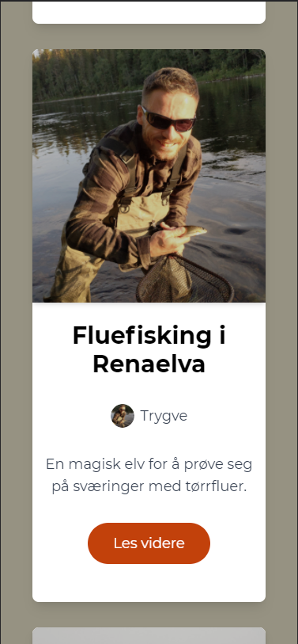

# Blog app for Turnusgutta 🎣
 

	
\
True fishermen of the north truly need their own blog, blogging is macho!\
The app is designed for easy publishing trough GraphCMS`s system. With React as cornerstone and Next.js, GraphQL/GraphCMS and Tailwind.css as compononents to make it awesome ⚛️

#### Test in your browser👇
<a href="https://turnusgutta.vercel.app/" target="_blank">turnusgutta.vercel.app</a>\
This version will be updated whenever the boys go fishing or out exploring 🌲

#### Download 💻
In the project directory, you can run:
`npm start`

Runs the app in the development mode.\
Open [http://localhost:3000](http://localhost:3000) to view it in your browser.

The page will reload when you make changes.\
You may also see any lint errors in the console. 

#### Functionality 🤖
* [X] Modern UI responsive for all platforms. 
* [X] Comments under each post.
* [X] With featured and recent posts. 
* [X] Almost true fish stories. 

#### Database 💾
GraphQL is used as querying language, and is retrieving data using GraphQL Queries trough the GraphCMS API and database. After creating the queries and API`s is it easy to use GraphCMS as administrator tool for the blog. Which also fishers who are not developers can use. 

#### React & Next.js ⚛️
React based Next.js i used as framework for the app. Next.js have done some improvements from plain React that i like. 
* Automatic routing is something that is saves me some time with setting the project up. 
* Next.js API route support with the ability to write direct queries to third party databases, like GraphCMS. 
* The code splitting is of each JS component is making the app faster. 

#### Tailwind 🎨
Tailwind is used in this project as a CSS framework, I think it gives you more flexibility in creating own components than Material UI, Bootstrap and Bulma. 
When building the project Tailwind automatically removes all unused CSS, for faster performance as well. 

 

